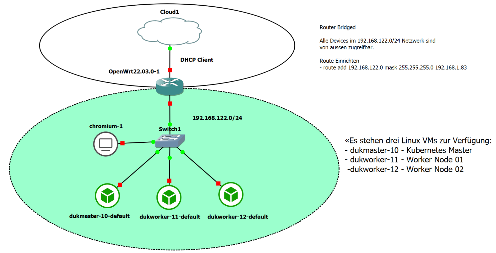

GNS3 Umgebung
=============

- - - 

Graphical Network Simulator-3 ist ein Netzwerk-Software-Emulator, der erstmals 2008 veröffentlicht wurde. Er ermöglicht die Kombination von virtuellen und realen Geräten, die zur Simulation komplexer Netzwerke verwendet werden.

### Quick Start

Installiert [Git/Bash](https://git-scm.com/downloads), [Multipass](https://multipass.run/) und [Terraform](https://www.terraform.io/).

Git/Bash Kommandozeile (CLI) starten und dieses Repository clonen.

    git clone https://github.com/mc-b/gns3
    cd gns3
    
Terraform Initialisieren und VMs erstellen

    terraform init
    terraform apply
    
Terraform verwendet [Multipass](https://multipass.run/) um die VM zu erstellen.

Nach erfolgreicher Installation werden weitere Informationen für den Zugriff auf die VMs angezeigt.

Nach der Installation sollte überprüft werden, ob die Virtualisierung aktiviert ist:    

    sudo virt-host-validate qemu
    
Wenn der erste Eintrag `FAIL` anzeigt ist die KVM Unterstützung zu deaktivieren. Dazu die Konfigurationsdatei `/opt/gns3/.config/GNS3/2.2/gns3_server.conf` um folgenden Eintrag ergänzen:

    [Qemu]
    enable_kvm = false

Nested Virtualization
---------------------

Einige Beispiel brauchen die Möglichkeit VMs zu erstellen. Dazu ist die Nested Virtualization (VM in VM) zu aktivieren.

Bei Hyper-V sind folgende Schritte, in der PowerShell als Administrator, notwendig
* VM stoppen, z.B. mittels Hyper-V Manager oder Multipass 
* Nested Virtualization aktivieren
* VM starten und ggf. IP-Adresse überprüfen.

Die Befehle sind wie folgt: 

    multipass stop gns3-60-default
    Set-VMProcessor -VMName gns3-60-default -ExposeVirtualizationExtensions $true
    multipass start gns3-60-default
    
Einschränkungen
---------------

Ein Teil der Infrastrukturen (Hyper-V, AWS), erlaubt es nicht das der OpenWrt Router eine IP-Adresse bezieht.

Das hat zur Folge, dass hinterliegenden VMs keine Verbindung zum Internet aufbauen können.

Abhilfe: NAT Gateway statt Cloud und OpenWrt Router verwenden.
