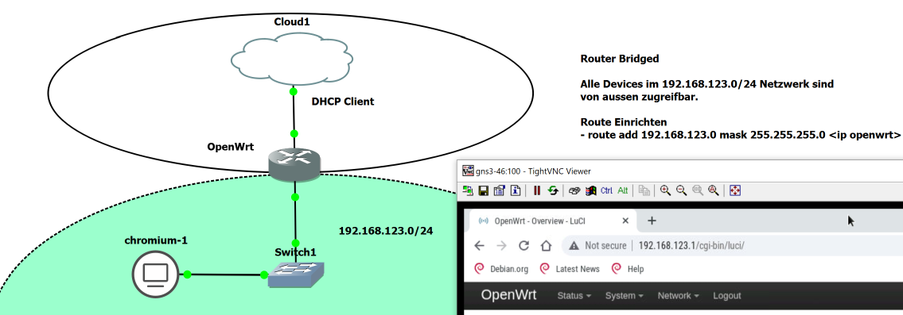

GNS3 Projekte
=============

* [Router Bridge-Modus](router-bridget.md)
* [Router WireGuard](router-wireguard.md)
* [WebShop mit Reverse Proxy](webshop-reverseproxy.md)
* [WebShop mit LoadBalancer](webshop-loadbalancer.md)
* [Kubernetes Cluster](microk8s-cluster.md)
* [MAAS Metal as a Service](maas.md)
* [Docker und Kubernetes (DUK)](duk.md)
* [DevOps Engineering Practices & Tools (CDI)](cdi.md)

Allgemeines
-----------

- - -

Alle Projekte beinhalten einen [OpenWrt Router](https://openwrt.org/) und eine einfach Chrome Browser Oberfläche.

Beim Router ist Ethernet0 der LAN link (Netzwerk 192.168.123.0/24), Ethernet1 der WAN link (DHCP-Client).

Routing
-------

Um das Routing zu vereinfachen hat der Router immer die gleiche MAC Adresse: "0c:96:5c:0f:00:00". 

**Hinweis**: die gleiche MAC Adresse ist angenehm, wenn man auf seinem lokalen PC ein paar Projekte durchspielen will. Befinden sich mehrere GNS3 Umgebungen im gleichen Netzwerk ist die MAC Adresse zu ändern.

**Windows (als Administrator)**

    route add 192.168.123.0 mask 255.255.255.0 192.168.1.31
    
Die IP-Adresse `192.168.1.31` ist durch die IP des Router zu ersetzen.   

Wird OpenVPN, über WireGuard, verwendet bekommt der PC eine IP-Adresse vom entfernten Netzwerk. 
Deshalb ist beim Routing, dann die Router IP-Adresse vom entfernten Netzwerk, hier `10.0.46.249` statt `192.168.1.31`, anzugeben. 
    
**Linux**

    sudo ip route add 192.168.123.0/24 via 10.0.46.249 dev br0

Die IP-Adresse `10.0.46.249` ist durch die IP des Router zu ersetzen.

Auf Linux wird die Route automatisch entfernt, wenn der Router (GNS3 Projekt) nicht mehr läuft.

Deshalb Route in `/etc/netplan/50-cloud-init.yaml` eintragen, z.B.

    network:
        version: 2
        ethernets:
            ens4:
                dhcp4: false
                dhcp6: false
        bridges:
          br0:
           dhcp4: true
           interfaces:
             - ens4
           routes:
             - to: 192.168.123.0/24
               via: 10.0.46.249
               metric: 100
               
Und aktivieren

    sudo netplan generate
    sudo netplan apply  
    

Port (Range) forward
--------------------

Port forwards werden nur benötigt, wenn sich der GNS3 Server in einen separaten Netzwerk via VPN (WireGuard) befindet.

Die Umsetzung geht am einfachsten mittels nginx. Dazu ist die nginx Konfiguration zu erweitern.

Einzelner Port für den OpenWrt Router weiterleiten:
    
    cat <<EOF | sudo tee /etc/nginx/sites-enabled/openwrt
    server {
        listen 8080 default_server;
        location / {
            proxy_pass http://192.168.123.1:80/;
        }
    }
    EOF
    
    sudo systemctl restart nginx
        
Mehrere Ports weiterleiten, z.B. für Kubernetes, gleichzeitig soll die IP-Adresse mittels Router aufgelöst werden:     

    cat <<EOF | sudo tee /etc/nginx/sites-enabled/duk
    server {
            listen 31250-31350 default_server;
            location / {
                    resolver    10.0.46.249;
                    proxy_pass  http://dukmaster-10-default:\$server_port;
            }
    }
    server {
            listen 32000-32200 default_server;
            location / {
                    resolver    10.0.46.249;
                    proxy_pass  http://dukmaster-10-default:\$server_port;
            }
    }
    server {
            listen 8443 default_server;
            location / {
                    resolver    10.0.46.249;
                    proxy_pass  https://dukmaster-10-default:\$server_port;
            }
    }
    EOF
    
    sudo systemctl restart nginx
    
`10.0.46.249` ist die IP-Adresse des Routers und entsprechend anzupassen.

In Microk8s Master wechseln und zum Testen Container starten

    kubectl run hello-world --image registry.gitlab.com/mc-b/misegr/hello-world --restart=Never 
    kubectl expose pod/hello-world --type="LoadBalancer" --port 80
    kubectl get all
    
Alternativen
------------

* [HA Proxy](http://docs.haproxy.org/)
* [Linux Virtual Server](http://www.linuxvirtualserver.org/)
* [Linux Virtual Server - Load Balancer im Eigenbau](https://www.linux-magazin.de/ausgaben/2018/07/load-balancer/)
    
Netzwerk Tools
--------------

Folgende Netzwerk Tools erleichtern die Fehlersuche.

Ausgabe der bekannten IP-Adressen/Hostnamen

    arp

Nächste DHCP IP-Adresse abfragen:

     sudo nmap --script broadcast-dhcp-discover
     
IP-Adresse für DNS-Namen ausgeben:

    host dukmaster-10-default 10.0.46.249
    
`10.0.46.249` ist die IP-Adresse des Routers und entsprechend anzupassen.  

### Links    

* [Nginx LB Doku](https://docs.nginx.com/nginx/admin-guide/load-balancer/http-load-balancer/)
* [Nginx proxy-pass Doku](http://nginx.org/en/docs/http/ngx_http_proxy_module.html#proxy_pass)
* [What Is Nginx Load Balancing?](https://cloudinfrastructureservices.co.uk/nginx-load-balancing/)
* [Nginx Proxy a large port range to equivalent port on a different ip address](https://serverfault.com/questions/279262/nginx-proxy-a-large-port-range-to-equivalent-port-on-a-different-ip-address)
