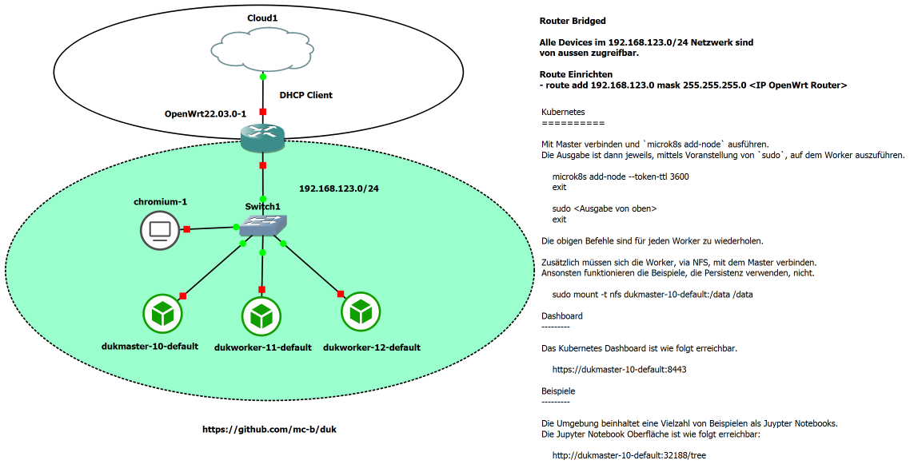

Docker und Kubernetes - Übersicht und Einsatz
=============================================

- - -

Umgebung für Kurs: [Docker und Kubernetes - Übersicht und Einsatz](https://github.com/mc-b/duk).

**ACHTUNG** es werden mindestens 32 GB RAM benötigt.