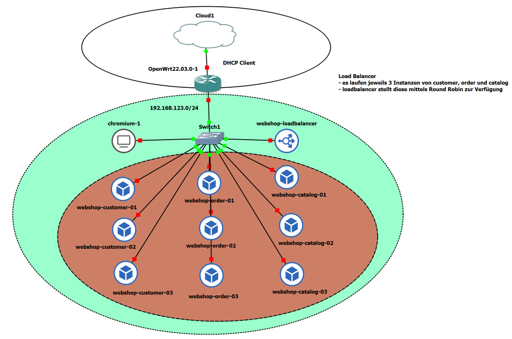

WebShop mit LoadBalancer
========================

- - -

3 x 3 VMs `customer-01 - 03`, `order-01 - 03`, `catalog-01 - 03` welche mittels der 4. VM `loadbalancer` angesprochen werden können.

Als Load Balancer kommt ein [nginx](http://nginx.org) Webserver zum Einsatz.

Die wichtigsten Einträge in der [nginx](http://nginx.org) Konfiguration sind:

    # Server Gruppen
    upstream customer {
            server customer-01;
            server customer-02;
            server customer-03;
    }  
    
    server {
        ...
        
        location /customer {
                proxy_pass      http://customer/;
        }  
    }
    
Die Einträge für `order` und `catalog` sind ähnlich.    

Alternative Linux Virtual Server
--------------------------------

Wenn auf den zusätzlichen nginx Server, im GNS3 Projekt, verzichtet werden soll, kann stattdessen Linux Virtual Server verwendet werden.

Infrastruktur
* 192.168.123.1     - OpenWrt Router in GNS3 Projekt
* 192.168.123.171   - order-01
* 192.168.123.164   - order-02

**GNS3 VM**

Port Weiterleitung mittels ngnix erweitern

    cat <<EOF | sudo tee /etc/nginx/sites-enabled/openwrt
    server {
        listen 8080 default_server;
        location / {
            proxy_pass http://192.168.123.1:80/;
        }
    }
    server {
        listen 8081 default_server;
        location / {
            proxy_pass http://192.168.123.1:8081/;
        }
    }    
    EOF
    
    sudo systemctl restart nginx
    
**OpenWrt Router**

    opkg update
    opkg install ipvsadm
    ipvsadm -A -t 192.168.123.1:8081 -s rr
    ipvsadm -a -t 192.168.123.1:8081 -r 192.168.123.171:80 -m
    ipvsadm -a -t 192.168.123.1:8081 -r 192.168.123.164:80 -m

Ansprechen über die IP-Adresse der GNS3 VM mit dem Port 80

    curl <ip gns3 vm>:8081

    