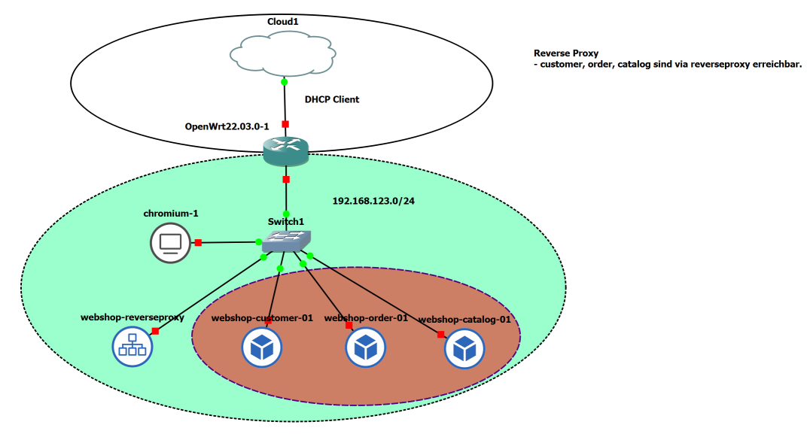

WebShop mit Reverse Proxy
=========================

- - -

3 VMs `customer-01`, `order-01`, `catalog-01` welche mittels der 4. VM `reverseproxy` angesprochen werden können.

Das Entspricht dem Muster "Reverse Proxy".

Als Reverse Proxy kommt ein [nginx](http://nginx.org) Webserver zum Einsatz.

Die wichtigsten Einträge in der [nginx](http://nginx.org) Konfiguration sind:

    location /order {
            proxy_pass      http://order-01/;
    }
    location /customer {
            proxy_pass      http://customer-01/;
    }
    location /catalog {
            proxy_pass      http://catalog-01/;
    }
    